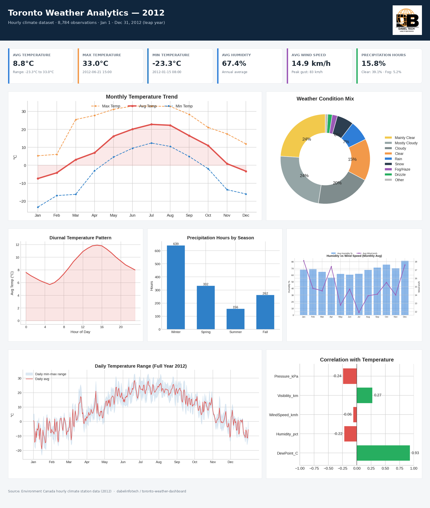

# Toronto Weather Dashboard (2012)

Data cleaning, KPI derivation, and an interactive HTML analytics dashboard
built from an hourly weather dataset (Environment Canada station data,
Toronto, Ontario — full leap year 2012, 8,784 hourly observations).

**[dabelinfotech](https://github.com/dabelinfotech)** · Leading The Digital Revolution

---

## Dashboard preview

> GitHub doesn't render live HTML/JS in the file browser, so here's a static snapshot.
> For the full interactive version (hover tooltips, season filter), download
> `output/Toronto_Weather_Dashboard_2012.html` and open it in your browser — or see
> [Viewing the dashboard](#viewing-the-dashboard) below for a live-hosted option.



A print-friendly, multi-page version is also available as a PDF:
**[report/Toronto_Weather_Dashboard_Report.pdf](report/Toronto_Weather_Dashboard_Report.pdf)**

## What's inside

| Path | Description |
|---|---|
| `data/Weather_Data.csv` | Raw hourly weather data (source file) |
| `weather_analysis.py` | Cleans the data, validates quality, computes KPIs and all chart aggregations → `dashboard_data.json` |
| `generate_dashboard.py` | Builds the self-contained interactive HTML dashboard from `dashboard_data.json` (with optional logo embedding) |
| `dashboard_data.json` | Pre-computed aggregated output (KPIs, monthly/hourly/seasonal/daily aggregates, condition mix, correlations) |
| `assets/dabeltech_logo_cleaned.png` | Brand logo (background/cropped) embedded in the dashboard header |
| `output/Toronto_Weather_Dashboard_2012.html` | The final, ready-to-open **interactive** dashboard |
| `report/dashboard_snapshot.png` | Static PNG snapshot of the full dashboard (viewable directly on GitHub) |
| `report/Toronto_Weather_Dashboard_Report.pdf` | Static multi-page PDF version of the dashboard + analysis summary |
| `report/build_charts.py`, `build_poster.py`, `build_pdf.py` | Scripts that regenerate the PNG snapshot and PDF from `dashboard_data.json` |
| `push_to_github.sh` | Script to initialize git and push this project to GitHub |

## Viewing the dashboard

The static image/PDF above are the quickest way to see the results directly on GitHub.
To interact with the live version (season filter, hover tooltips):

1. **Download locally** — click into `output/Toronto_Weather_Dashboard_2012.html` on GitHub,
   use the download/raw button, then open the downloaded file in any browser. Works fully offline.
2. **GitHub Pages** (live shareable link) — in the repo, go to **Settings → Pages**, set
   Source to `Deploy from a branch`, branch `main`, folder `/ (root)`, then save. Your dashboard
   will be reachable at:
   `https://dabelinfotech.github.io/toronto-weather-dashboard/output/Toronto_Weather_Dashboard_2012.html`

   > Note: GitHub Pages only works on **public** repos on the free plan.

## Regenerating the static snapshot / PDF

```bash
cd report
python build_charts.py   # rebuilds the 7 chart PNGs from dashboard_data.json
python build_poster.py   # assembles dashboard_snapshot.png
python build_pdf.py      # assembles Toronto_Weather_Dashboard_Report.pdf
```

## Quick start

```bash
pip install -r requirements.txt

# 1. Clean the data and compute KPIs / aggregates
python weather_analysis.py --input data/Weather_Data.csv --output dashboard_data.json

# 2. Build the dashboard (with the Dabel Tech logo in the header)
python generate_dashboard.py \
  --input dashboard_data.json \
  --output output/Toronto_Weather_Dashboard_2012.html \
  --logo assets/dabeltech_logo_cleaned.png
```

Open `output/Toronto_Weather_Dashboard_2012.html` in any browser — no server required, works fully offline.

## Data quality

The source data was validated (not just assumed clean): zero nulls, zero duplicate
timestamps, complete hourly coverage across the full leap year with no gaps, and no
out-of-range values (humidity 0–100%, non-negative wind speed/visibility).

## Key findings

- Strong seasonal cycle: average temperature ranges from about **-7.4°C in January**
  to **~22°C in summer** (56.3°C between the single hottest and coldest hours recorded).
- **~39%** of all hours were clear/mainly clear; only **~16%** had active precipitation
  and **~5%** had fog/haze.
- Winter has the most precipitation *hours* despite being the coldest season — typical
  of persistent snow events in a continental climate.
- Physical relationships hold as expected (validating data integrity): dew point tracks
  temperature closely (r ≈ 0.93), humidity is inversely related to visibility (r ≈ -0.63),
  and lower pressure is associated with higher wind speed (r ≈ -0.36).

## Pushing to GitHub

```bash
chmod +x push_to_github.sh
./push_to_github.sh
```

By default this creates/pushes to `github.com/dabelinfotech/toronto-weather-dashboard`.
Override any of these via environment variables before running:

```bash
GITHUB_ORG=myorg REPO_NAME=my-repo REPO_VISIBILITY=private ./push_to_github.sh
```

Requires [git](https://git-scm.com/) and, for automatic repo creation, the
[GitHub CLI](https://cli.github.com/) (`gh auth login` first). Without `gh`,
the script prints manual instructions for creating the remote repo yourself.

## License

MIT — see [LICENSE](LICENSE).
